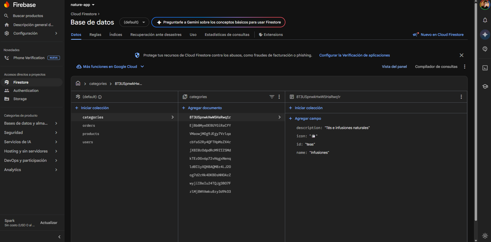

# NatureApp

NatureApp es una aplicación móvil de comercio electrónico enfocada en la venta de productos naturales, suplementos y hierbas. Está construida con **React Native (Expo)** y utiliza **Firebase** como plataforma Backend-as-a-Service (BaaS).



## Características Principales

- **Autenticación**: Registro y login de usuarios seguros.
- **Catálogo de Productos**: Listado de productos organizados por categorías.
- **Búsqueda Avanzada**: Búsqueda por nombre de producto y filtros rápidos.
- **Carrito de Compras**: Gestión de ítems antes de proceder al pago.
- **Historial de Pedidos**: Los usuarios pueden ver el estado y los detalles de compras anteriores.

## Integración con Firebase (BaaS)

Anteriormente la aplicación utilizaba un servidor local de base de datos y una API en Node.js, pero fue migrada a **Firebase** para aprovechar la infraestructura escalable en la nube.

Lo que se hizo en la integración:

1. **Firebase Auth**: Manejo completo de autenticación (Email/Contraseña) y persistencia de sesión local con `AsyncStorage`.
2. **Firestore Database**:
   - Colección `products`: Contiene el inventario en tiempo real.
   - Colección `categories`: Información de filtros visuales.
   - Colección `users` y `orders`: Almacenamiento seguro de datos de clientes y su historial de pedidos.
3. **Firebase Storage**: Configurado para la futura subida de avatares de usuarios y fotos dinámicas de productos.
4. Se migró toda la comunicación REST hacia los hooks y métodos nativos del SDK de Firebase, lo que permite consultas más rápidas y con filtros en memoria.

## Gestión de Estado Global (Zustand)

Para mejorar el rendimiento y la escalabilidad, la aplicación utiliza **Zustand** como manejador de estado global.

**¿En qué consiste?**
Toda la lógica de la aplicación que antes se encontraba encapsulada de manera aislada ha sido trasladada a múltiples tiendas (_stores_) globales modulares: `authStore`, `cartStore`, `productStore`, y `orderStore`. Estas tiendas se encargan de centralizar la conexión a Firebase y el estado en memoria.

**¿Cómo influye en la aplicación?**
En lugar de que cada pantalla consulte la base de datos de manera independiente cada vez que el usuario navega a ella, los datos principales se consultan de Firebase y se almacenan en el estado global. Cuando la información se modifica (ej. agregar un producto al carrito), el store se actualiza e inmediatamente toda la interfaz de la aplicación reacciona en tiempo real.

**Beneficios:**

- **Reducción de Costos**: Al evitar consultas asíncronas repetitivas al cambiar de pantalla, se reducen drásticamente las lecturas en Firestore, optimizando la cuota de uso.
- **Rapidez Inmediata**: Puesto que los datos ya están precargados en memoria global, las interacciones en la UI son instantáneas y completamente fluidas.
- **Arquitectura Limpia**: El estado y las conexiones lógicas residen fuera de los componentes de React, haciendo el código más ordenado, predecible y fácil de mantener.

## Requisitos Previos

- [Node.js](https://nodejs.org/en/) (v18 o superior)
- [Git](https://git-scm.com/)
- Aplicación [Expo Go](https://expo.dev/go) instalada en tu dispositivo móvil (o usar emulador iOS/Android).
- Un proyecto creado en [Firebase Console](https://console.firebase.google.com/) con **Auth (Email)** y **Firestore** habilitados.

## Instalación

1. Clona este repositorio y navega hasta el directorio:

   ```bash
   git clone <url-del-repo>
   cd NatureApp
   ```

2. Instala las dependencias:

   ```bash
   npm install
   ```

3. **Configura Firebase (Variables de Entorno)**:
   Renombra el archivo `.env.example` como `.env` en la raíz del proyecto y agrega las credenciales de tu proyecto de Firebase. Es importante usar el prefijo `EXPO_PUBLIC_` para que Expo pueda leerlas en la aplicación.

   ```env
   EXPO_PUBLIC_API_KEY="TU_API_KEY"
   EXPO_PUBLIC_AUTH_DOMAIN="tu-proyecto.firebaseapp.com"
   EXPO_PUBLIC_PROJECT_ID="tu-proyecto"
   EXPO_PUBLIC_STORAGE_BUCKET="tu-proyecto.appspot.com"
   EXPO_PUBLIC_MESSAGING_SENDER_ID="TUS_SENDER_ID"
   EXPO_PUBLIC_APP_ID="TU_APP_ID"
   ```

4. **Poblar la Base de Datos (Seeding)**:
   Si tu Firestore está vacío, puedes insertar los productos y categorías iniciales ejecutando:
   ```bash
   npm run seed
   ```

## Ejecución

Inicia el servidor de desarrollo de Expo:

```bash
npx expo start
```

- Escanea el código QR desde la aplicación de cámara (iOS) o desde la app Expo Go (Android) para ver la aplicación en tu celular.
- Presiona `a` para abrirla en un Emulador de Android.
- Presiona `i` para abrirla en un Simulador de iOS.

## Estructura de Carpetas

```text
/app             # Rutas y Pantallas principales (Expo Router)
/screens         # Recursos e imágenes ilustrativas del proyecto
/docs            # Informes del instructivo de la creación de la app
/scripts         # Scripts de utilidad (como seedFirestore.js)
/src/
  ├── components # Componentes visuales reutilizables (ProductCard, etc.)
  ├── services   # Integraciones directas con Firebase
  ├── store      # Estado global usando Zustand (authStore, cartStore, etc.)
  └── types      # Interfaces y modelos de TypeScript
```
