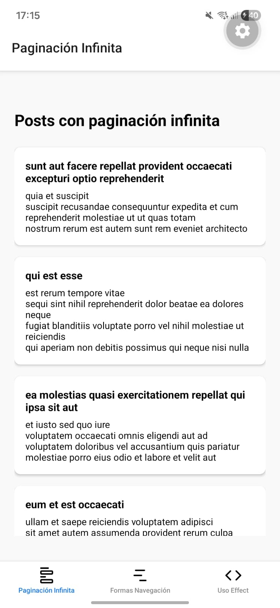
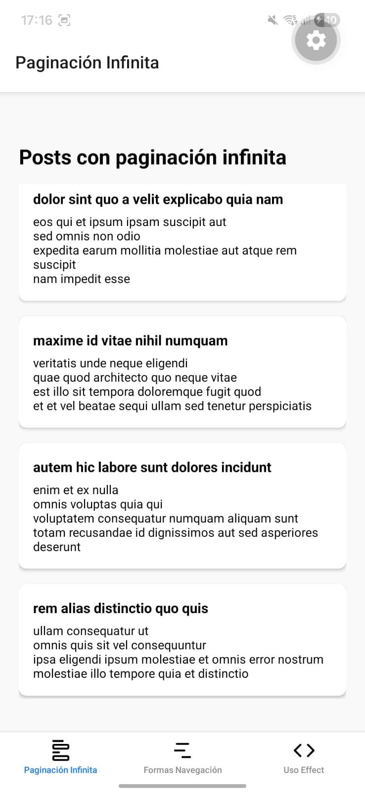
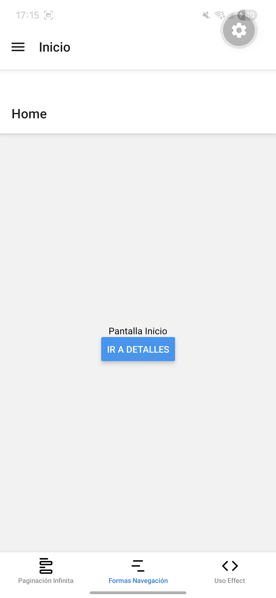
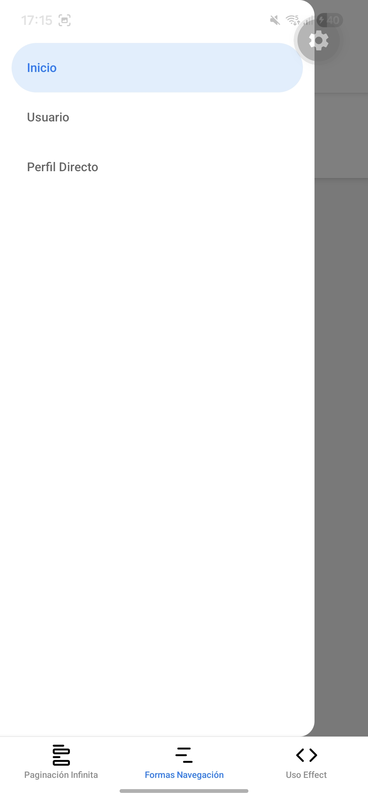
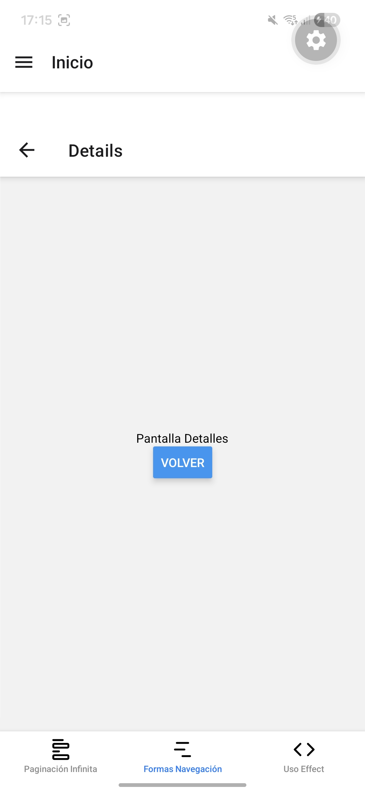
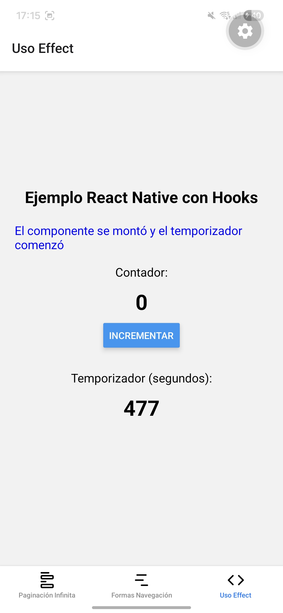
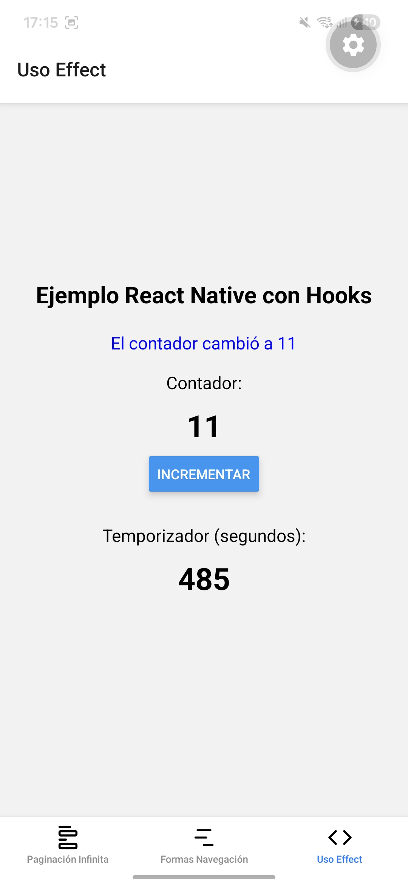

# Ejercicio Semana 07

Este proyecto consiste en una aplicación desarrollada con React Native que integra la gestión avanzada de navegación, el consumo de APIs con paginación y el manejo de estados mediante hooks.

## Paginación Infinita

Se ha implementado una interfaz de lista que utiliza paginación infinita para cargar datos de manera dinámica mediante FlatList.

|                 Vista inicial                  |                     Scroll                     |
| :--------------------------------------------: | :--------------------------------------------: |
|  |  |

## Estructuras de Navegación

La aplicación utiliza la biblioteca React Navigation para combinar distintos patrones de interacción.

### Navegación

Se incluye un menú lateral que permite al usuario desplazarse entre las secciones principales de la aplicación de forma rápida y organizada.

|                 Vista inicial                  |             Menú Lateral (Drawer)             |                    Navegación de pila                    |
| :--------------------------------------------: | :--------------------------------------------: | :--------------------------------------------: |
|  |  |  |

## Gestión de Estado y Ciclo de Vida (Hooks)

Uso de hooks como `useState` y `useEffect` para controlar la lógica interna de los componentes. Estos ejemplos incluyen la gestión de temporizadores automáticos y contadores interactivos que responden a las acciones del usuario y a los eventos de montaje y desmontaje de la interfaz.

|                 Interfaz de Hooks y Temporizador                  |                     Interacción con el estado del contador                     |
| :--------------------------------------------: | :--------------------------------------------: |
|  |  |